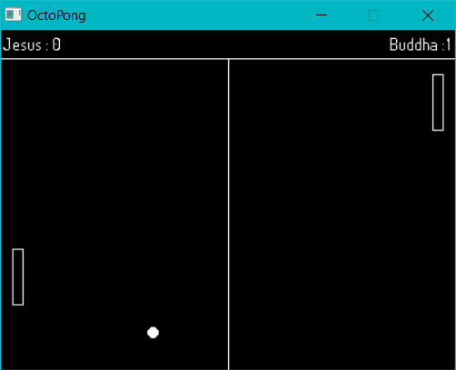
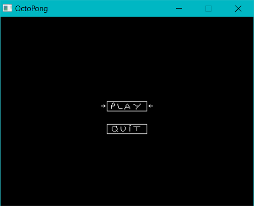

# L'octoPong

## Présentation

Ceci est un **projet personnel** que je code sur mon temps libre. Il consiste à recréer un **Pong**.

Pour cela, je code en **C++**, avec **Code::Blocks**, en utilisant la bibliothèque **SDL**.

J'essaye de rendre mon code toujours **lisible**, en respectant quelques principes de **Clean Code** ou de **SOLID**.

N'hésitez pas à y jeter un coup d'oeil ;)

Petit aperçu :

## Branche `managers`

En commençant à m'attaquer aux menus du jeu, je me suis rendu compte que la structure actuelle de mon jeu n'était absolument pas adaptée à l'ajout de menus.

Je travaille actuellement sur la branche `managers`, sur laquelle j'ai modifié totalement la hiérarchie des classes.

En **étudiant divers codes** sources d'autres petits jeux, j'ai choisi d'implémenter un fonctionnement basé sur des **managers**.

Chaque manager se charge d'une phase du jeu : menu principal, jeu, menu à l'intérieur du jeu, pourquoi pas un tableau des scores plus tard...

Cela m'a permis de créer facilement un premier menu principal, le prochain objectif étant le menu à l'intérieur du jeu.

